I had previously written about my cutting up of [clearfake](https://malpedia.caad.fkie.fraunhofer.de/details/js.clearfake)
which you can find [here](../clearfake/).

Quick recap:

- We deobfuscated the powershell obtained from a fake browser update prompt.
- The code executed base64 encoded command with window style hidden option.
- The command downloaded a `data.zip` file.

Now, the zip file is extracted, an exe is sought inside the contents and executed.
Here is the code responsible for that: 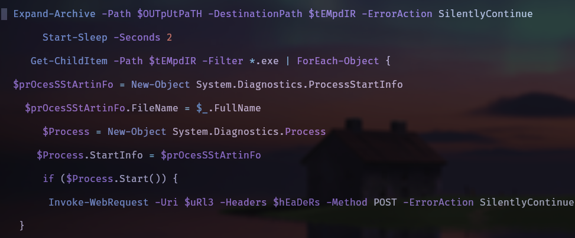

The zip file contains 4 files:

- hv.exe: The executable that will be run.
- iepdf32.dll: This is going to be loaded later.
- rhombohedron.ai: Probably encrypted configs or payload.
- shovelnose.deb: Photoshop color swatch.

hv.exe seems benign according to virustotal. 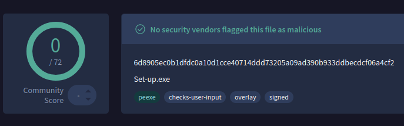

This is because the most important thing it does with respect
to the malware is to dynamically load the dll when run (dll sideloading).

When we look at the disassembly, we can see that it checks for that specific dll and errors when it is not found

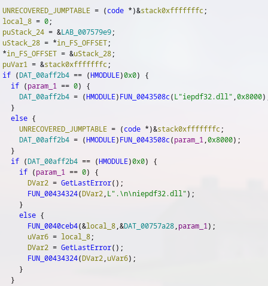

If successful iepdf32.dll is loaded. What does it do? Firstly, a quick upload to VT now lights up as a christmas tree (I can't remember many products picking
it up a few months ago. I may be mistaken of course)

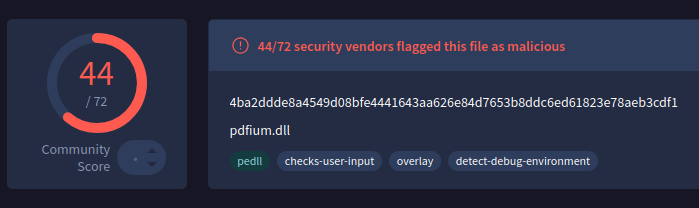

This dll has the standard debugger detection capabilities by leveraging `IsDebuggerPresent`. The other 2 files, `shovelnose.deb` and `rhombohedron.ai`
are now called by this dll.

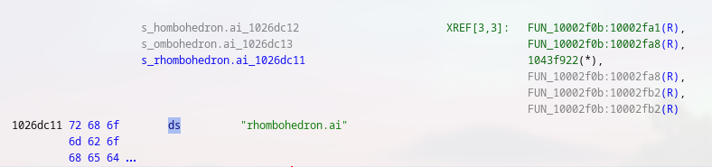

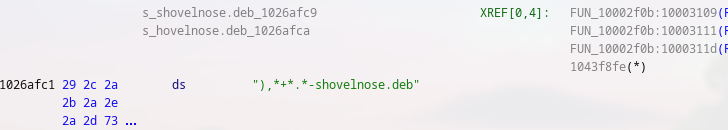

The dll seems to construct a path to rhombohedron file

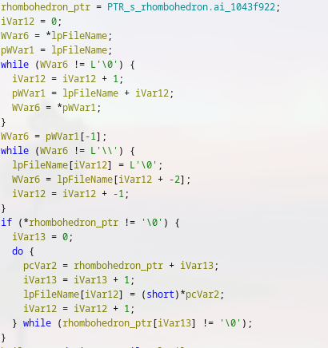

After constructing the path to it, it opens the file using `CreateFileW` with a generic read.

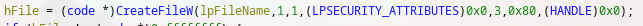

Now the code reads `rhombohedron.ai` into memory and verifies if the read worked.

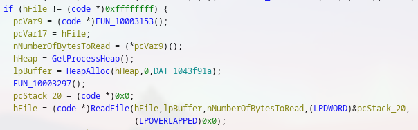

Entry point calculation is done and the payload is injected. Now the code is run directly from memory.

At this point the sample can be thrown into a sandbox and analyzed. Detonation shows it also reaches out to a couple
domains, which I assume are its C2.
Anyrun flags it correctly as Lumma

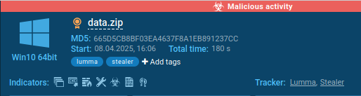

Here is the infection chain

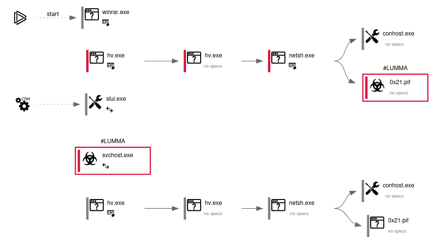

IOCs
=======================
parallelmercywksoffw[.]shop

landdumpycolorwskfw[.]shop

secretiveonnicuw[.]shop

notoriousdcellkw[.]shop

conferencefreckewl[.]shop

ohfantasyproclaiwlo[.]shop

barebrilliancedkoso[.]shop

liabiliytshareodlkv[.]shop

flourhishdiscovrw[.]shop

`data.zip` ca2b787bb72f0bd9d79013aa93800bfd84c73aad74662c48e69425e4adfb549b

`rhombohedron.ai` 67ff95298e395543ea0c9eeec6bfff81688df379bec578aa31c52d214b385180

`shovelnose.deb` cc38b5cb522fdf8d2fe5e85c50d72e1b8ac39d36deb157d4bffdda7970c5ba8b
