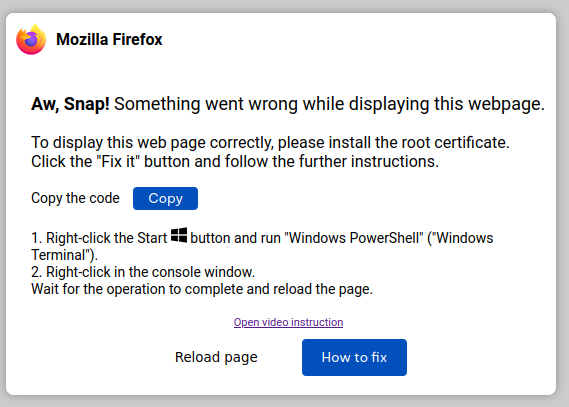
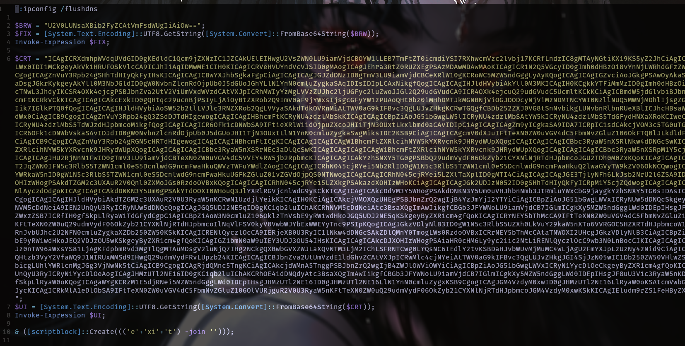
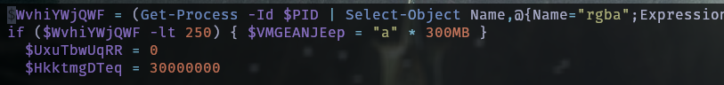
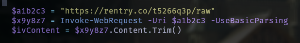
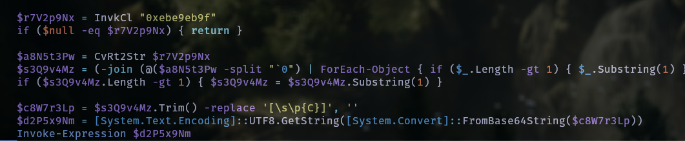
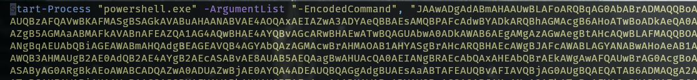
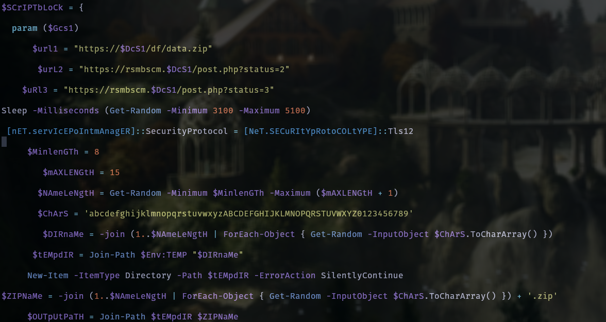
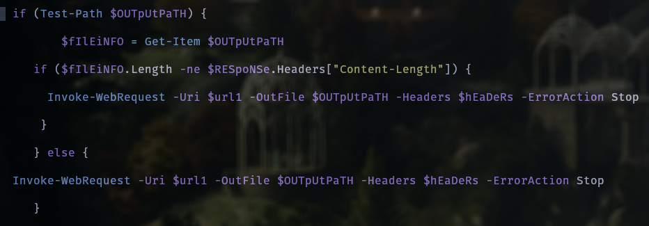
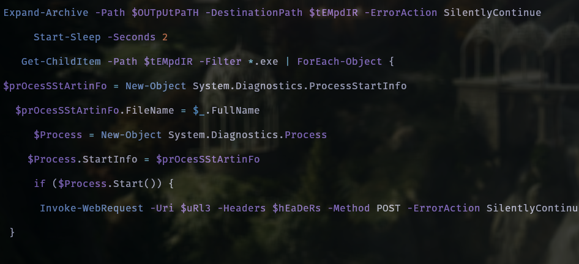

A while ago (around 7 months ago), I had obtained, through a friend, a sample of clearfake malware that was wrecking
havoc in one of his friend's servers.

This post is about analysis I had done. I have been procrastinating a lot on writing it, so here it goes...

Below is a screenshot of the infection method it uses, a notification to update your browser by
running some powershell.



I clicked copy and pasted it in Neovim. This is how it looked



## Stage1
Nothing particularly difficult here, just some base64 values that are to be decoded and of course
the dangerous invoke-expression cmdlet.

> **Tip**: If you are a Neovim user add the following to your init.lua. It will save you lots of trouble
and make your work efficient when base64 decoding stuff. With it simply highlight the base64 encoded
string and hit `<leader>bd` in visual mode.

```lua
vim.keymap.set('v', '<leader>bd', 
    [[y:lua vim.fn.setreg('"',
    vim.fn.system('base64 -w 0 --decode',
    vim.fn.getreg('"')))<cr>gvP]],
    { noremap = true, silent = true })
```
Here is the decoding process inside neovim:

[](https://asciinema.org/a/Oqzl1uNkNkvjWMDJIfiNfMhPb)

The first string sets the clipboard value to nothing. The second encoded string is where the fun happens.

## Stage2
The first part of the code checks for some memory space and increases it to 300mb if it's less than 200mb.



It then reaches out to `rentry.co` and fetches some data


It does a lot more stuff pertaining to getting down some encrypted commands, decrypts it and finally runs an `IEX`.
Iex basically means the code is executed on the fly.


Simply changing iex to echo gave me the command to be run by the malware.



The malware basically runs a base64 encoded script with the `--windowstyle hidden` option. We can decode it swiftly now since we know that Neovim b64 decode trick.

## Stage3
After base64 decoding, the code does not need any more deobfuscation, apart from some variable cleanup.
It just creates the keys and IV for decryption. The main snippet to be focused on is below:



The code sets a couple of urls, the first to download a payload `data.zip`, and the other 2 for status checks.
It then generates a random alphanumeric name.
Now it attempts to download the malicious zip file and notifies the attacker of the download.



Finally it searches for an exe file, executes the first one it finds and alerts the attacker by sending a POST to the third url.



Remember the urls in mention had an encrypted domain name `$DcS1`? Decrypting that showed the domain is **businessresources[.]ltd.**
That means the malicious zip file can be obtained by downloading it from **https[:]//businessresources[.]ltd/df/data[.]zip.**

The url is dead now but I still have the data.zip file obtained from the analysis.

I'll break down the contents of the data.zip file in another post. Stay tuned for that.

IOCs
====
https[:]//businessresources[.]ltd/df/data[.]zip

https[:]//rsmbscm[.]businessresources[.]ltd/post.php?status=2

https[:]//rsmbscm[.]businessresources[.]ltd/post.php?status=3

83f3d303f1d764476e238f3d7abe0faf

665d5cb8bf03ea4637f8a1eb891237cc
