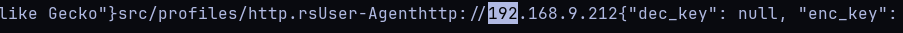
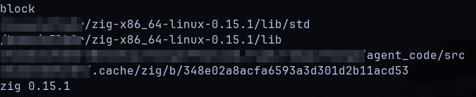
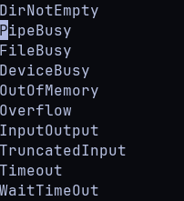

This is a follow up on my previous [article](https://pop-ecx.github.io/reflections-on-writing-a-mythic-c2-agent-in-zig/).

It is generally about my journey in searching for a relatively unknown and easy to understand packer to obfuscate my custom zig C2 agent.
If you are generally looking for a tutorial on how to pack binaries, this is not it. I will not go into the details of how packers work, 
but rather share what led me to the final solution.

## Why pack?
If you've ever written any lower level code, you must've noticed that the resulting binaries have stuff in them that you explicitly didn't put there,
like function names, strings, and other metadata. This is especially true for languages like C, C++, zig, and rust, which are compiled to machine code.

Below is an example trying to read some of the metadata from a popular Mythic C2 agent.

Yes, just running `strings` on the binary gives you a lot of information about the binary, including potential IOCs like user-agent strings and URLs.
This specific agent has an option of protecting itself though.

One of the most obvious ways to protect your binary is use encryption. The agent I mentioned above does exactly this. It handles encryption and decryption 
using AES. This approach is pretty solid but has its downsides. One of the main ones is aside from the fact that the key has to be in the binary, is encryption
using tried and tested libraries yields a binary that has a high entropy. This is a red flag for AVs and EDRs, which often use entropy as one of the signals to 
detect sus binaries.

Since entropy becomes a problem, we could opt for a simpler solution that doesn't involve encryption.

During this time, one of my initial ideas was to create a custom packer, and have that option baked into my c2 agent. I had a few ideas on how to 
do this, but I quickly realized there was a simple one out there. Plus it was written in zig, which meant I could understand and modify what the code does.
The solution was [zyra](https://github.com/CX330Blake/ZYRA), a simple xor packer written in zig.

## How I chose to use it
The idea behind zyra is simple. It xors the binary with a key, and then adds a stub that will xor the binary back to its original form and execute it.
This is a simple and effective way to obfuscate a binary. The downside is that it is not very secure, as xor is a weak form of encryption.
But for my case it was good enough. I just wanted to obfuscate the binary enough to get past inital static analysis.Plus, if I need to, 
I can always rip out pertinent parts of the code and modify to my liking.

Zyra has releases, so baking it into my agent build process was easy, though I recommend building it from source.
Now when I build my agent, I have a config option to pack the binary with zyra.

Here is how it looks like to build the agent without and with zyra.

The resulting binary is much closer in terms on entropy to the normal binary, but with the added benefit of potential IOCs being obfuscated.

## Possible future work
As I mentioned earlier, xor is a weak form of enryption. A more secure option is potentially using a stream cipher like RC4 or ChaCha20 (which are in zyra's TODOs).

Another potential improvement is to use a rotating key (which I plan to do when I have the time).
