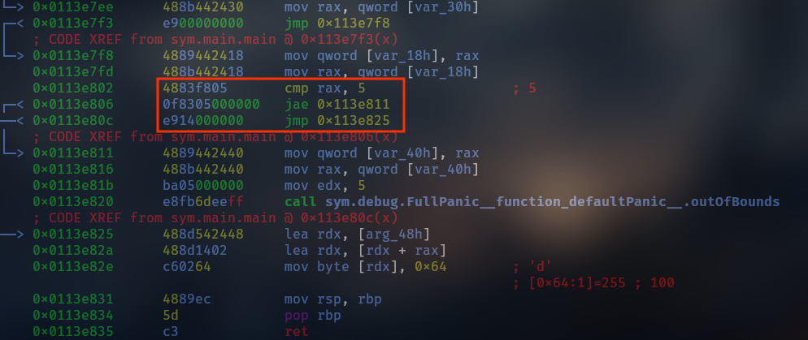
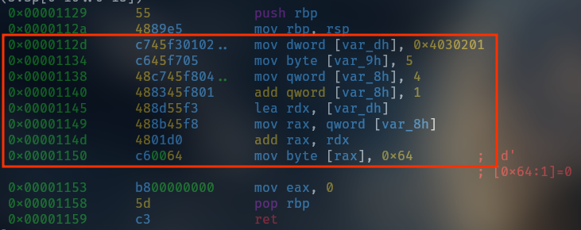

Zig provides spatial memory safety. It can perform bounds checking at compile time,
for comptime known values, and crash with appropriate stack trace for runtime values. This means
it prevents out-of-bounds access to arrays etc.

We'll take a look at 2 simple examples to see how this works in practice.

### Example 1: Compile time known values

```zig
const std = @import("std");


pub fn main() void{
	var buffer = [_]u8{1, 2, 3, 4, 5};
	const index: usize = 5;
	buffer[index] = 100;
}
```

In this example, we have an array `buffer` of 5 elements. We then try to access
`buffer[5]`, which is out of bounds since the valid indices are 0 to 4.
Since the values are known at compile time,
Zig will detect this and produce a compile-time error.

```bash
m3lk0r@parrot:~$ /home/m3lk0r/.cache/zig/p/N-V-__8AAN5NhBR0oTsvnwjPdeNiiDLtEsfXRHd1fv-R3TOv/zig build-exe main.zig
main.zig:7:12: error: index 5 outside array of length 5
    buffer[index] = 100;
           ^~~~~
referenced by:
    callMain [inlined]: /home/m3lk0r/.cache/zig/p/N-V-__8AAN5NhBR0oTsvnwjPdeNiiDLtEsfXRHd1fv-R3TOv/lib/std/start.zig:618:22
    callMainWithArgs [inlined]: /home/m3lk0r/.cache/zig/p/N-V-__8AAN5NhBR0oTsvnwjPdeNiiDLtEsfXRHd1fv-R3TOv/lib/std/start.zig:587:20
    posixCallMainAndExit: /home/m3lk0r/.cache/zig/p/N-V-__8AAN5NhBR0oTsvnwjPdeNiiDLtEsfXRHd1fv-R3TOv/lib/std/start.zig:542:36
    2 reference(s) hidden; use '-freference-trace=5' to see all references
```

### Example 2: Runtime values

```zig
pub fn main() void {
    var buffer = [_]u8{1, 2, 3, 4, 5};
    var index: usize = 4;
    index += 1;
    buffer[index] = 100;
}
```

In this example, we have the same array `buffer`, but the index is determined at runtime. We start with `index` set
to 4, and then we increment it by 1, making it 5. When we try to access `buffer[5]`, it is out of bounds.
Since the index is not known at compile time, Zig will allow the code to compile, but it will crash at runtime with an appropriate stack trace.

```bash
m3lk0r@parrot:~$ ./zig-bootstrap/zig/stage3/bin/zig build-exe main.zig
m3lk0r@parrot:~$ file main
main: ELF 64-bit LSB executable, x86-64, version 1 (SYSV), statically linked, with debug_info, not stripped
m3lk0r@parrot:~$ ./main
thread 2816 panic: index out of bounds: index 5, len 5
/home/m3lk0r/main.zig:5:11: 0x11abd16 in main (main.zig)
    buffer[index] = 100;
          ^
/home/m3lk0r/zig-bootstrap/zig/stage3/lib/zig/std/start.zig:679:59: 0x11ab332 in callMain (std.zig)
    if (fn_info.params.len == 0) return wrapMain(root.main());
                                                          ^
/home/m3lk0r/zig-bootstrap/zig/stage3/lib/zig/std/start.zig:190:5: 0x11aadb1 in _start (std.zig)
    asm volatile (switch (native_arch) {
    ^
Aborted (core dumped)
```
In order to see how Zig does this under the hood, we need to check its AIR.
You can read more about AIR [here](https://mitchellh.com/zig/sema).

> Zig master (0.16.0, at the time of writing) is used for this example

First, we need to compile the code to dump AIR. Run the following:

`zig build-obj --verbose-air main.zig`

> Make sure to use the debug build of the Zig compiler, as `--verbose-air` is only available for debug build of the compiler.

The AIR produced is some ~220000 lines, so we will just look at main.
```txt
# Begin Function AIR: main.main:
# Total AIR+Liveness bytes: 771B
# AIR Instructions:         35 (315B)
# AIR Extra Data:           60 (240B)
# Liveness tomb_bits:       24B
# Liveness Extra Data:      12 (48B)
# Liveness special table:   4 (32B)
  %0!= save_err_return_trace_index()
  %1!= dbg_stmt(2:5)
  %2 = alloc(*[5]u8)
  %3!= store(%2, <[5]u8, "\x01\x02\x03\x04\x05".*>)
  %5!= dbg_var_ptr(%2, "buffer")
  %6!= dbg_stmt(3:5)
  %7 = alloc(*usize)
  %8!= store_safe(%7, <usize, 4>)
  %9!= dbg_var_ptr(%7, "index")
  %10!= dbg_stmt(4:5)
  %11 = load(usize, %7)
  %12!= dbg_stmt(4:11)
  %13 = block(usize, {
    %27 = add_with_overflow(struct { usize, u1 }, %11!, @.one_usize)
    %28 = struct_field_val(%27, 1)
    %29 = cmp_eq(%28!, @.one_u1)
    %30!= cond_br(%29!, cold {
      %2! %27! %7!
      %31!= call(<fn () noreturn, (function 'integerOverflow')>, [])
      %32!= unreach()
    }, {
      %33 = struct_field_val(%27!, 0)
      %34!= br(%13, %33!)
    })
  } %11!)
  %14!= store_safe(%7, %13!)
  %15!= dbg_stmt(5:5)
  %16 = load(usize, %7!)
  %17!= dbg_stmt(5:11)
  %18 = cmp_lt(%16, <usize, 5>)
  %21!= block(void, {
    %22!= cond_br(%18!, likely {
      %23!= br(%21, @.void_value)
    }, cold {
      %2!
      %19!= call(<fn (usize, usize) noreturn, (function 'outOfBounds')>, [%16!, <usize, 5>])
      %20!= unreach()
    })
  } %18!)
  %24 = ptr_elem_ptr(*u8, %2!, %16!)
  %25!= store_safe(%24!, <u8, 100>)
  %26!= ret_safe(@.void_value)
# End Function AIR: main.main
```
Understanding from `%0` to `%15` will be left as an exercise to the reader. 
At `%16`,  `%16 = load(usize, %7!)` loads the current value of index.
`%18 = cmp_lt(%16, <usize, 5>)` asks if the index, which is 5 is less than the array length.
Next, `%22!= cond_br(%18!, likely ` checks if index is 0-4 and continues to `%23!`
if it is. But in our case, this check fails and therefore `cold` path is taken which calls 
`%19!= call(<fn (usize, usize) noreturn, (function 'outOfBounds')>, [%16!, <usize, 5>])`
This means the final write (from `%24` to `%26`) doesn't happen since cold path `%20` was taken
and `thread 257906 panic: index out of bounds: index 5, len 5` is printed on stdout.

You can also see it in the disassembly since AIR is lowered to machine code.



Compare that with an equivalent C code compiled without `-fsanitize=address` flag.




**Isn't this a bad thing? Why does it compile if it is going to crash at runtime?**
Not really. If the index is known at compile time, it gets caught and
fixed([zen 6](https://ziglang.org/documentation/master/#Zen)). But if the index is not known at compile time, Zig still provides a tool
to catch out-of-bounds access at runtime, which is better than allowing undefined behavior([zen 5](https://ziglang.org/documentation/master/#Zen)).

Plus, the entire idea of Zig when building binaries is to first build in debug mode,
which has all these safety checks, and once the bugs have been pruned, you can build in any release mode, depending on your needs(speed, size, safety).
