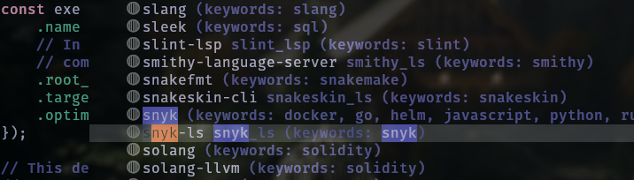
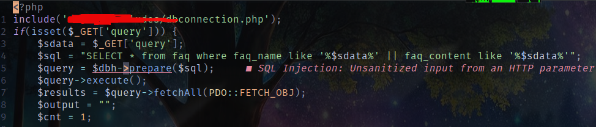

In my [previous post](../nvim-dev/) I talked about how you can use snyk
in your editor as you code and even added snyk-ls as a must
have. I had a bit of a tough time
finding the correct configuration to achieve this using
Neovim. Perhaps you are, right now, on the same path as 
myself last year. Luckily for you, I gotchu.

Before proceeding, make sure you have a snyk account and 
activate snyk code.

## 1. Use Mason to install snyk-ls
Install snyk-ls using mason. It's as simple as entering
command mode, typing `Mason`, searching for snyk and pressing
`i` for install. It should show up in the installed section
in Mason's interface.



## 2. Configure snyk-ls
Now that snyk-ls is successfully installed, we need to 
configure it for use in our editor. To do this we'll 
define a setup function with the correct options to make it usable.
Add the following code in your init.lua

```lua
lspconfig.snyk_ls.setup({
    init_options = {
        activateSnykCode = "true",
        activateSnykIac = "true",
        cliPath = "/usr/local/snyk-linux",
        path = "/usr/local",
        token = "2678260b-d526-47c1-a3d9-669d643d47e6"
        trustedFolders = {"/your/trusted/local/repo"}
    }
})
```
For the token option, use your auth token for snyk code, And no,
that is not my snyk token (✿╹◡╹)

source your config file to activate snyk-ls.

## Result
After a successful configuration, cd into one of your local repos
and open a file. Snyk will go through your code and highlight lines
that are potentially plagued by security issues.



For debugging purposes run `:LspInfo` to check if snyk-ls is attached
to the open buffer. If not run `:LspLog` to check for any errors.

>  Note

> Remember to make sure the language you are writing is supported by snyk

Check out the snyk [docs](https://docs.snyk.io/scm-ide-and-ci-cd-integrations/snyk-ide-plugins-and-extensions/snyk-language-server) for more information.
