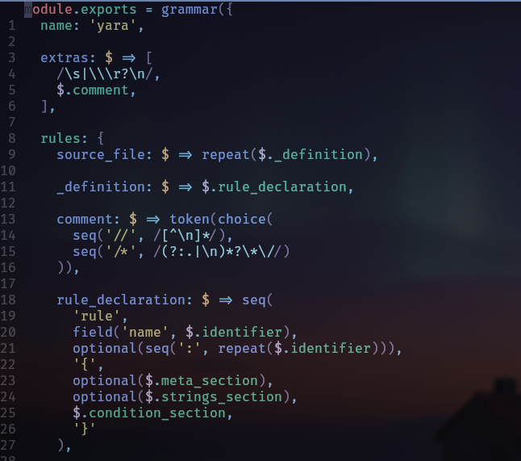
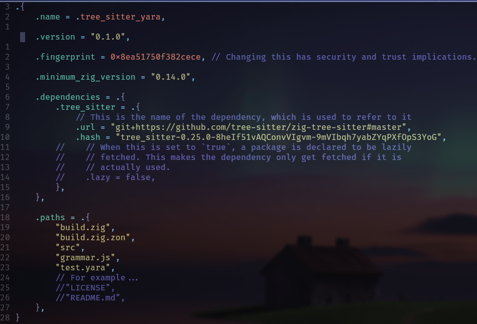
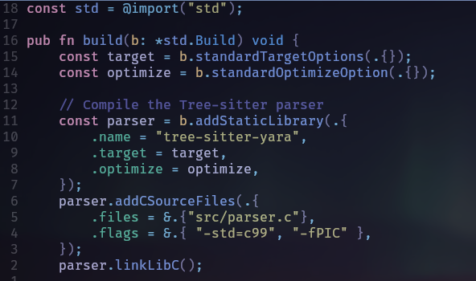
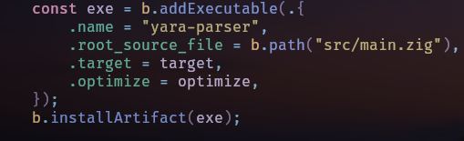
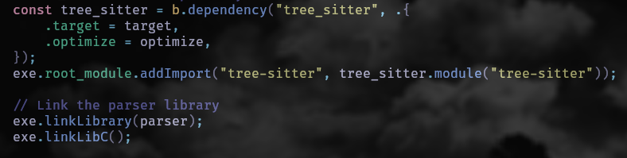
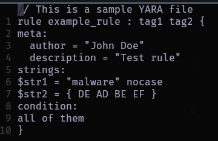
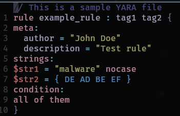

It's been a while since I wrote yara rules. In fact, the last time I did, I was still using vscode. I needed now to write one. So I chose to 
look at one of my local yara rules repo. Opened it in nvim and ... no syntax highlighting.


Easy fix though. Treesitter is what provides highlighting for my setup, so I did `:TSInstall yara`. Damn!! No yara parser. That meant I had to write
a custom one. An awesome excuse to use zig (I think this is the low level language for me)  and more importantly, to learn.

This blog post details the adventures of writing a grammar for a yara parser using treesitter. The goals of this post are to touch on writing a grammar
using treesitter and to extend this by writing a parser for yara rules in zig. This is not going to be a full tutorial, just overall pointers (pun not intended).

## Getting started
This is how the project directory structure will look like:

```cmd
.
├── bindings
│   ├── c
│   │   └── tree_sitter
│   ├── go
│   ├── node
│   ├── python
│   │   ├── tests
│   │   └── tree_sitter_yara
│   ├── rust
│   └── swift
│       ├── TreeSitterYara
│       └── TreeSitterYaraTests
├── queries
├── src
│   └── tree_sitter
└── zig-out
    └── bin
```

The only directories we'll create are `src/` when we initialize our zig project and `queries/` which we'll use later. The rest will be created by treesitter
when we generate the parser. The `bindings/` directory contains the bindings for various languages. We will use the parser.c code in our `src/` to write our parser in zig.

The first thing to do is install the treesitter cli. There are various ways to do this. I opted to use cargo but feel free to [check this out](https://www.npmjs.com/package/tree-sitter-cli).

## Creating the grammar
The grammar is written in js. Before writing any line of code, we need to understand yara rules format. The most basic format looks like below

```yara
rule rule_name : tag1 tag2 {
    meta:
        key = "value"
    strings:
        $string1 = "text" nocase
        $string2 = { hex_bytes }
    condition:
        all of them
}
```

Knowing what a basic rule would look like, we know we have 3 main sections:

- meta section: which includes the rules metadata
- strings: holds string values to be searched over. They can be a hex sequence, normal string, string with escape sequences etc.
- condition: outlines the conditions for the selection.

Now we can try to outline the grammar.

This will contain the specific sections outlined. The full code can be found [here](https://github.com/pop-ecx/tree-sitter-yara/blob/main/grammar.js).

Here is a snippet of how that would look like 



With a complete grammar file that includes identifying comments, meta sections, strings, conditions etc we can generate a treesitter parser. However, before that
remember we are going to use zig to write a custom parser. So we need to initialize a zig project using `zig init`

Now, provided everything about our grammar is fine, we can run `tree-sitter generate` to create the parser. In the src directory, we'll find a parser.c if generartion was successful. This is cool because
now we can run `tree-sitter parse example.yar` and it will return an AST. Congrats ladies and gentlemen we wrote a simple custom treesitter parser.

## Writing a custom yara standalone parser 
Since I've been learning zig, and I'm loving it so far, we can write a custom yara rules parser. That'll also teach us how to use zig dependencies and writing build files
that will include c source. The first thing we need to do is download [zig treesitter bindings](https://github.com/tree-sitter/zig-tree-sitter).

### Zig zon 
No, that's not just a fun phrase to say. In zig, dependencies are handled in a `zig.zon` file. In it, you define what your dependencies are. This includes name, version, minimum zig version. The most important part is the dependencies struct. Here you define the struct dependency name, provide a url field and hash. The url can be a github repo and you can 
pin a specific branch or even a commit. The hash field is a tricky one because it is not the typical hash you'd find in the version release of a project on github. The hacky way to get the correct hash is to run zig fetch, zig will complain of the wrong hash and provide you the correct one. There's a better way to do this as explained [here](https://www.youtube.com/watch?v=jy7w_7JZYyw).

Here is how my zig.zon looks like

 

### Build file
This is where things get interesting. One of the selling points of zig is your build script does not have to be in a bespoke, weird language like make.
You build zig code by writing a build script in zig. This becomes interesting because everything we'd need to compile our code will be included here.
We'll make a public build function in our build.zig which will take a parameter b which is a pointer to std.Build. We'll also add our c source files (remember parser.c ?) for compilation and link it to libc.



> The function we use for adding our code is deprecated. I just use it as a vestige of zig 0.13.0. Old habits you know.

Not done yet. Now we need to provide steps for creating our executable. For this, we use `addExecutable()`. In it we can provide options like the name of the executable, root source files (where our main zig code will live), targets and optimizations, whether it should be stripped and use PIC etc. We finally create an install step with `installArtifact()`



Next, we add treesitter zig bindings as a dependency.



### The parser
Now that we're done with foreplay, let's get to business

The parser will be a simple one. It will take a yara rule file, parse it and return the AST. The first thing we need to do is import the treesitter bindings and the parser we generated earlier.
Our code will only have two functions: main() and printNodeIndented().

```zig 
const std = @import("std");
const ts = @import("tree-sitter");
```

The main function will take an argument which is the path to the yara rule file. It will then read the file, parse it using the treesitter parser and print the AST. If a file is not
provided, it will get pissed at you, print a usage message and exit. If the file cannot be opened or read, it will print an error message and exit.

```zig
pub fn main() void {
    var gpa = std.heap.GeneralPurposeAllocator(.{}){};
    defer _ = gpa.deinit();
    const allocator = gpa.allocator();

    const args = std.process.argsAlloc(allocator) catch |err| {
        std.debug.print("Error allocating arguments: {}\n",
        .{err});
        std.process.exit(1);
    };
    defer std.process.argsFree(allocator, args);

    if (args.len != 2) {
        std.debug.print("Usage: {s} <yara_file>\n", .{args[0]});
        std.process.exit(1);
    }
    const file_path = args[1];

    const file = std.fs.cwd().openFile(file_path, .{})
    catch |err| {
        std.debug.print("Error opening file '{s}': {}\n",
        .{file_path, err});
        std.process.exit(1);
    };
    defer file.close();
    const source = file.readToEndAlloc(allocator, 1024 * 1024)
    catch |err| {
        std.debug.print("Error reading file '{s}': {}\n",
        .{file_path, err});
        std.process.exit(1);
    };
    defer allocator.free(source);
```

Next, we create a treesitter parser using `ts.Parser.Create()`. We then set the language to yara using `parser.setLanguage()`. If this fails, we print an error message and exit.

> Note the use of `defer` in zig. The specific line with this keyword will be executed when the function goes out of scope, whether it exits normally or due to an error. This is useful for cleaning up resources like file handles or memory allocations.


```zig
    const parser = ts.Parser.create();
    defer parser.destroy();

    parser.setLanguage(tree_sitter_yara()) catch |err| {
        std.debug.print("Error setting language: {}\n", .{err});
        std.process.exit(1);
    };

    const tree = parser.parseString(source, null) orelse {
        std.debug.print("Error: Failed to parse '{s}'\n",
        .{file_path});
        std.process.exit(1);
    };
    defer tree.destroy();
```

Next, we'll print the AST using the `printNodeIndented()` function. This function will take a node and print it in an indented format. It will recursively print the children of the node.

```zig
    const root = tree.rootNode();
    std.debug.print("Syntax Tree:\n", .{});
    printNodeIndented(allocator, root, 0);

```
The `printNodeIndented()` function will take a node, an allocator and an indent level. It will print the node type, its start and end positions and its children. The indent level will be used to indent the output.

```zig
fn printNodeIndented(allocator: std.mem.Allocator,
    node: ts.Node, indent: usize) void {
    const c_str = ts_node_string(node);
    defer std.c.free(@constCast(c_str));
    const span = std.mem.span(c_str);
    
    var i: usize = 0;
    while (i < indent) : (i += 1) {
        std.debug.print("  ", .{});
    }

    std.debug.print("{s}\n", .{span});

    const childCount = node.childCount();
    var i_child: u32 = 0;
    while (i_child < childCount) : (i_child += 1) {
        const child = node.child(i_child).?;
        printNodeIndented(allocator, child, indent + 1);
    }
}
```

The entire code can be found [here](https://github.com/pop-ecx/tree-sitter-yara/blob/main/src/main.zig)

## Usage in neovim
The main reason I wrote this parser is to use it in neovim. To do this, we need to create a treesitter query file. This file will contain the queries that we want to run on the yara rules. The queries will be written in a specific format that treesitter understands.

But first, we need to install the treesitter plugin for neovim. You can do this using your favorite plugin manager. Afterwards, you can add the following lines to your `init.lua`:

```lua
local treesitter = require("nvim-treesitter.configs")
local parser_config = require("nvim-treesitter.parsers")
                      .get_parser_configs()

parser_config.yara = {
  install_info = {
    url = "https://github.com/pop-ecx/tree-sitter-yara",
    files = { "src/parser.c" },
    generate_requires_npm = false,
    requires_generate_from_grammar = false,
  },
  filetype = "yara",
}

vim.filetype.add({
  extension = {
    yara = "yara",
    yar = "yara",
  }
})
```

You can also pass a local path to the `url` field if you have cloned the repository locally.

Now run `:TSInstall yara` to install the parser.

Next, we need to create a query file in the `queries/` directory. This file will contain the queries that we want to run on the yara rules. The queries will be written in a specific format that treesitter understands.

The query files can be found in the repository [here](https://github.com/pop-ecx/tree-sitter-yara/blob/main/queries/highlights.scm). Once you copy the queries to your directory, you'll get syntax highlighting according to your theme.

Here is a screenshot of how it looks like without and with treesitter yara.





## Conclusion

In this blog post, we explored how to write a custom parser for yara rules using treesitter and zig. We started by understanding the basic structure of yara rules and then wrote a grammar for it. After generating the parser, we wrote a simple zig program that uses the treesitter bindings to parse yara rules and print the AST. Note that the project is not completely done yet. There are still some things to do like writing tests and improving the grammar. However, this should give you a good starting point for writing your own custom parser using treesitter and zig.

> P.S: My standalone parser is still a work in progress.

> P.P.S: I found out recently there is a similar project [here](https://github.com/egibs/tree-sitter-yara)
